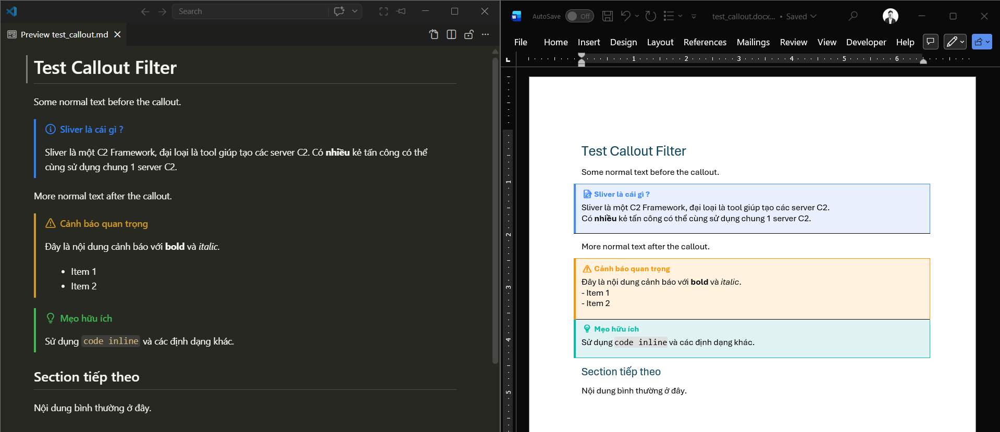

# 📦 Pandoc Filters

A collection of [Pandoc Lua filters](https://pandoc.org/lua-filters.html) for converting [Obsidian](https://obsidian.md/) Markdown to other formats with high-fidelity styling.

---

## 🎨 obsidian-callouts.lua

Converts Obsidian [callout blocks](https://help.obsidian.md/Editing+and+formatting/Callouts) into beautifully styled boxes when exporting to **DOCX** — complete with coloured left border, light background shading, and emoji icons, closely matching how they appear in Obsidian.

### ✨ Features

- 🎯 **25 callout types** — `note`, `tip`, `warning`, `danger`, `info`, `success`, `question`, `bug`, `example`, `quote`, and more
- 🖌️ **Obsidian-matching colours** — each callout type has its own border colour and background fill
- 📝 **Rich content preserved** — bold, italic, code, strikethrough, links, bullet/ordered lists, code blocks, headings, and nested blockquotes are all retained inside callouts
- 🏷️ **Automatic title** — if no custom title is provided, the callout type name is used (capitalised)
- ⚡ **Zero dependencies** — pure Lua, no external tools or reference documents required

### 📋 Supported Callout Types

| Type | Icon | Border | Type | Icon | Border |
|------|:----:|--------|------|:----:|--------|
| `note` | 📝 | Blue | `success` / `check` / `done` | ✅ | Green |
| `tip` / `hint` | 💡 | Teal | `question` / `help` / `faq` | ❓ | Amber |
| `info` | ℹ️ | Blue | `failure` / `fail` / `missing` | ❌ | Red |
| `important` | ❗ | Light Blue | `danger` | 🔴 | Red |
| `warning` / `caution` | ⚠️ | Orange | `bug` | 🐛 | Red |
| `abstract` / `summary` / `tldr` | 📋 | Light Blue | `example` | 📖 | Purple |
| `todo` | ☑️ | Blue | `quote` / `cite` | 💬 | Grey |

> Unrecognised types will use a default blue style with 📌 icon.

### 🚀 Usage

```bash
pandoc input.md -o output.docx --lua-filter obsidian-callouts.lua
```

### 📖 Example

**Markdown (Obsidian):**

```markdown
> [!note] Ghi chú quan trọng
> Đây là nội dung callout với **bold** và *italic*.
> - Item 1
> - Item 2

> [!warning] Cảnh báo
> Hãy cẩn thận khi thực hiện thao tác này.

> [!tip]
> Callout không có tiêu đề — tự động dùng tên type.
```

**DOCX output:**

Each callout renders as a styled box with:

```
┌─────────────────────────────────────┐
┃ 📝 Ghi chú quan trọng              │  ← Bold coloured title
│                                     │
│ Đây là nội dung callout với bold    │  ← Light background fill
│ và italic.                          │
│ • Item 1                            │
│ • Item 2                            │
└─────────────────────────────────────┘
  ▲ Thick coloured left border
```

### ⚙️ Requirements

- [Pandoc](https://pandoc.org/) **≥ 2.17** (tested with 3.9)
- Output format: **docx**
  - For non-docx formats, callouts pass through as regular blockquotes

### 🔧 Installation

1. Download `obsidian-callouts.lua`
2. Place it in your Pandoc data directory or project folder:
   - **Windows:** `%APPDATA%\pandoc\filters\`
   - **macOS / Linux:** `~/.local/share/pandoc/filters/`
3. Use with the `--lua-filter` flag:

```bash
pandoc notes.md -o notes.docx --lua-filter obsidian-callouts.lua
```

Or add it to a `defaults.yaml` file:

```yaml
filters:
  - obsidian-callouts.lua
```

## 📄 License

MIT
